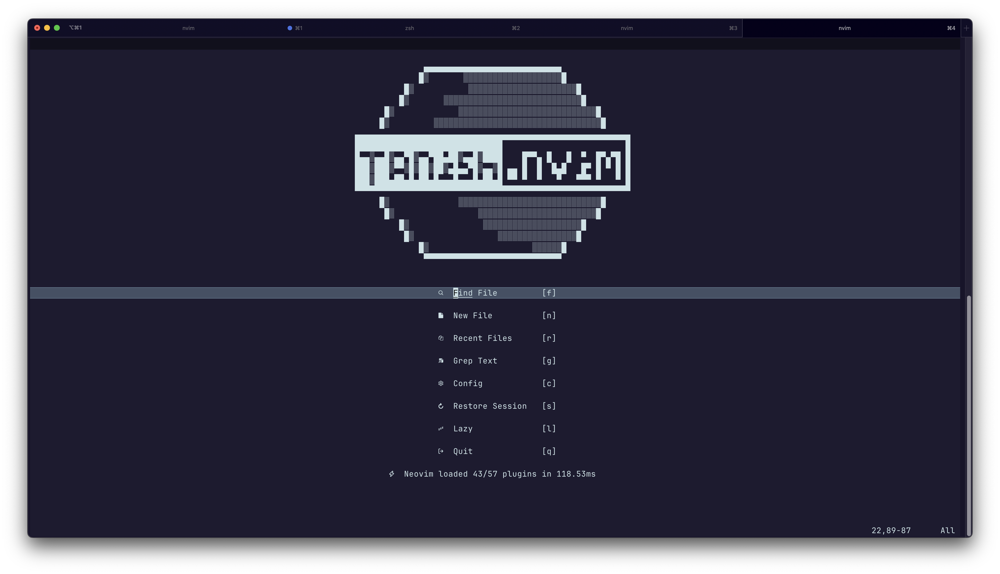

# tanish.dotfiles

```md
━┏┓━━━━━━━━━━━━━━━━┏┓━━━━━━┏┓━━━━━┏┓━━┏━┓━━┏┓━━━━━━━━━
┏┛┗┓━━━━━━━━━━━━━━━┃┃━━━━━━┃┃━━━━┏┛┗┓━┃┏┛━━┃┃━━━━━━━━━
┗┓┏┛┏━━┓━┏━┓━┏┓┏━━┓┃┗━┓━━┏━┛┃┏━━┓┗┓┏┛┏┛┗┓┏┓┃┃━┏━━┓┏━━┓
━┃┃━┗━┓┃━┃┏┓┓┣┫┃━━┫┃┏┓┃━━┃┏┓┃┃┏┓┃━┃┃━┗┓┏┛┣┫┃┃━┃┏┓┃┃━━┫
━┃┗┓┃┗┛┗┓┃┃┃┃┃┃┣━━┃┃┃┃┃┏┓┃┗┛┃┃┗┛┃━┃┗┓━┃┃━┃┃┃┗┓┃┃━┫┣━━┃
━┗━┛┗━━━┛┗┛┗┛┗┛┗━━┛┗┛┗┛┗┛┗━━┛┗━━┛━┗━┛━┗┛━┗┛┗━┛┗━━┛┗━━┛
━━━━━━━━━━━━━━━━━━━━━━━━━━━━━━━━━━━━━━━━━━━━━━━━━━━━━━
━━━━━━━━━━━━━━━━━━━━━━━━━━━━━━━━━━━━━━━━━━━━━━━━━━━━━━
```

Everyone knows what dotfiles📁 are.

Every person who's played around with the CLI💻 long enough has their own
repository out there for the spacemen🧑‍🚀 to explore🪐☄️.

I've played around with the CLI💻 long enough to have my own repository out
there for the spacemen🧑‍🚀 to explore🪐☄️.

## Nvim screenshot



## TODO

1. Look into autopair fastwrap and pair config for nvim
